# Roadmap Architetturale

## Considerazioni sull'attuale architettura monolitica

Attualmente, il progetto è strutturato come un monolite con architettura MVC. Questa scelta offre diversi vantaggi:

- **Semplicità di sviluppo e distribuzione**: Tutto il codice è in un unico posto e può essere facilmente gestito e distribuito.
- **Performance**: Le chiamate interne tra componenti sono più veloci rispetto a un'architettura a microservizi.
- **Coerenza**: Un'unica base di codice significa che tutte le parti dell'applicazione sono sempre in uno stato coerente.

Tuttavia, un'architettura monolitica può presentare delle sfide, come la difficoltà di scalare singole parti dell'applicazione in modo indipendente e la potenziale complessità nel gestire un codice sorgente di grandi dimensioni.

## Evoluzione verso DDD e CQRS

L'approccio ideale per un'evoluzione architetturale del sistema sarebbe l'adozione dei pattern **Domain-Driven Design (DDD)** e **Command Query Responsibility Segregation (CQRS)**. Questi pattern sarebbero particolarmente adatti al contesto attuale per diverse ragioni.

### Fondamenta già presenti

È importante notare che alcune fondamenta per questa evoluzione architetturale sono già state strategicamente implementate:

- **Symfony Messenger**: La scelta di utilizzare questo componente non è casuale, ma rappresenta un primo passo verso un'architettura orientata agli eventi. Il bus comunicativo asincrono già presente nell'applicazione potrà facilmente accogliere servizi esterni e gestire la comunicazione tra componenti disaccoppiati in un futuro sistema distribuito.
- **Elasticsearch come read model**: L'attuale implementazione della ricerca ordini utilizza già Elasticsearch come database ottimizzato per le query, fornendo una naturale separazione tra operazioni di lettura e scrittura.
- **Pattern di Event Dispatching**: Il sistema già utilizza eventi di dominio per notificare cambiamenti agli ordini, facilitando l'implementazione di Event Sourcing in futuro.

### Roadmap di implementazione

Una possibile roadmap per questa evoluzione architetturale potrebbe essere:

1. **Riorganizzazione del codice esistente**:
  - Separare il dominio in bounded contexts (es. Order, Product)
  - Introdurre pattern come Value Objects, Aggregates e Entities
  - Implementare una struttura a layer (Domain, Application, Infrastructure, Presentation)

2. **Implementare CQRS**:
  - Separare Command e Query Models
  - Utilizzare Elasticsearch come modello di query dedicato (già parzialmente implementato)
  - Introdurre un Command Bus per la gestione delle operazioni di scrittura
  - Implementare Event Handlers per sincronizzare i modelli di lettura e scrittura

3. **Migrazione verso microservizi**:
  - Una volta identificati i bounded contexts, è possibile estrarli come servizi indipendenti
  - Introdurre comunicazione asincrona tra servizi tramite eventi di dominio
  - Implementare API Gateway per l'orchestrazione delle richieste
  - Adottare pattern come Saga per gestire transazioni distribuite

Questo approccio permetterebbe una transizione graduale dal monolite attuale verso un'architettura più scalabile e manutenibile, sfruttando al meglio le caratteristiche già presenti come l'uso di Elasticsearch e la gestione asincrona degli eventi.

## Concept diagramma dell'Architettura

```mermaid
graph TB
    %% Definizione degli stili
    classDef boundaryContext fill:#e6f7ff,stroke:#333,stroke-width:2px
    classDef domain fill:#d4f1f9,stroke:#333
    classDef application fill:#d5f5e3,stroke:#333
    classDef infrastructure fill:#faebcc,stroke:#333
    classDef aggregateRoot fill:#ffc6c4,stroke:#333,stroke-width:2px
    classDef domainEntity fill:#c9e6ff,stroke:#333
    classDef valueObject fill:#e6ccff,stroke:#333
    classDef event fill:#d5f5e3,stroke:#333,stroke-dasharray: 5 5
    classDef dataModel fill:#f9e6ff,stroke:#333,stroke-width:1px
    
    %% Bounded Context Ordini
    subgraph BC_Ordini[Bounded Context: Ordini]
        %% Domain Layer
        subgraph Domain_Ordini[Domain]
            subgraph OrderModels[Modelli di Dominio]
                Order["«AggregateRoot»
                Order 
                ------------------
                - id: OrderId
                - name: OrderName
                - description: OrderDescription
                - createdAt: CreationDate
                - items: OrderItem[]
                ------------------
                + addItem(productId, quantity): void
                + removeItem(itemId): void
                + calculateTotal(): Money"]
                
                OrderId["«ValueObject»
                OrderId
                ------------------
                - value: string
                ------------------
                + equals(other): bool"]
                
                OrderName["«ValueObject»
                OrderName
                ------------------
                - value: string"]
                
                OrderDescription["«ValueObject»
                OrderDescription
                ------------------
                - value: string"]
                
                CreationDate["«ValueObject»
                CreationDate
                ------------------
                - value: DateTime"]
                
                OrderItem["«Entity»
                OrderItem
                ------------------
                - id: ItemId
                - productId: string
                - productName: string
                - productPrice: Money
                - quantity: int
                ------------------
                + calculateSubtotal(): Money"]
                
                ItemId["«ValueObject»
                ItemId
                ------------------
                - value: string"]
                
                Money["«ValueObject»
                Money
                ------------------
                - amount: float
                - currency: string
                ------------------
                + add(Money): Money
                + multiply(factor): Money"]
                
                OrderEvents["«DomainEvents»
                ------------------
                OrderCreatedEvent
                OrderItemAddedEvent
                OrderItemRemovedEvent
                OrderConfirmedEvent
                OrderCancelledEvent"]
            end
            
            OrdiniRepo["«Repository Interface»
            OrderRepository
            ------------------
            + findById(OrderId): Order
            + findAll(): Order[]
            + save(Order): void
            + delete(OrderId): void"]
            
            OrdiniServices["«DomainService»
            OrderDomainService
            ------------------
            + validateOrder(Order): bool
            + confirmOrder(Order): bool
            + cancelOrder(Order): bool"]
        end
        
        %% Application Layer
        subgraph App_Ordini[Application]
            %% CQRS Pattern - Commands
            OrdiniCommands["«commands»
            ------------------
            CreateOrderCommand
            AddOrderItemCommand
            RemoveOrderItemCommand
            ConfirmOrderCommand
            CancelOrderCommand"]
            
            OrdiniCommandHandlers["«command handlers»
            ------------------
            CreateOrderHandler
            AddOrderItemHandler
            RemoveOrderItemHandler
            ConfirmOrderHandler
            CancelOrderHandler"]
            
            %% CQRS Pattern - Queries
            OrdiniQueries["«queries»
            ------------------
            GetOrderByIdQuery
            ListOrdersQuery
            SearchOrdersQuery
            FilterOrdersByStatusQuery
            FilterOrdersByDateQuery"]
            
            OrdiniQueryHandlers["«query handlers»
            ------------------
            GetOrderByIdHandler
            ListOrdersHandler
            SearchOrdersHandler
            FilterOrdersByStatusHandler
            FilterOrdersByDateHandler"]
        end
        
        %% Infrastructure Layer
        subgraph Infra_Ordini[Infrastructure]
            OrdDBEntities["«Database Entities»
            ------------------
            OrderEntity
            OrderItemEntity"]
            
            OrdESEntities["«Elasticsearch Documents»
            ------------------
            OrderDocument"]

            OrdiniRepoImpl["«Repository Implementation»
            MySQLOrderRepository
            ------------------
            + findById(OrderId): Order
            + findAll(): Order[]
            + save(Order): void
            + delete(OrderId): void"]
            
            OrdiniESRepo["«Repository Implementation»
            ElasticsearchOrderRepository
            ------------------
            + findById(id): OrderDocument
            + search(criteria): OrderDocument[]"]
            
            OrdDomainMapper["«Mapper»
            DomainToEntityMapper
            ------------------
            + toEntity(Order): OrderEntity
            + toDomain(OrderEntity): Order"]
            
            OrdESMapper["«Mapper»
            DomainToDocumentMapper
            ------------------
            + toDocument(Order): OrderDocument"]
            
            ElasticsearchService["«Service»
            ElasticsearchService
            ------------------
            + index(Order): void
            + search(query): SearchResult
            + get(id): OrderDocument
            + delete(id): void"]
            
            OrdiniDB[(Database Ordini)]
            OrdiniESIndex[(Elasticsearch)]
        end
    end
    
    %% Bounded Context Prodotti
    subgraph BC_Prodotti[Bounded Context: Prodotti]
        %% Domain Layer
        subgraph Domain_Prodotti[Domain]
            subgraph ProductModels[Modelli di Dominio]
                Product["«AggregateRoot»
                Product
                ------------------
                - id: ProductId
                - name: ProductName
                - price: Money
                - stock: Stock
                ------------------
                + updatePrice(Money): void
                + decreaseStock(quantity): bool
                + increaseStock(quantity): void
                + isAvailable(quantity): bool
                + getName(): string
                + getPrice(): Money"]
                
                ProductId["«ValueObject»
                ProductId
                ------------------
                - value: string
                ------------------
                + equals(other): bool"]
                
                ProductName["«ValueObject»
                ProductName
                ------------------
                - value: string"]
                
                Stock["«ValueObject»
                Stock
                ------------------
                - quantity: int
                - minThreshold: int?
                ------------------
                + decrease(quantity): Stock
                + increase(quantity): Stock
                + isAvailable(quantity): bool
                + isLow(): bool"]
                
                ProductEvents["«DomainEvents»
                ------------------
                ProductCreatedEvent
                ProductPriceChangedEvent
                ProductStockDecreasedEvent
                ProductStockIncreasedEvent
                ProductStockDepletedEvent
                ProductStockLowEvent"]
            end
            
            ProdottiRepo["«Repository Interface»
            ProductRepository
            ------------------
            + findById(ProductId): Product
            + findByCategory(CategoryId): Product[]
            + findAll(): Product[]
            + findAvailable(): Product[]
            + save(Product): void
            + delete(ProductId): void"]
            
            ProdottiServices["«DomainService»
            ProductStockService
            ------------------
            + reserveStock(Product, quantity): bool
            + releaseStock(Product, quantity): void
            + validateStockAvailability(Product, quantity): bool"]
        end
        
        %% Application Layer
        subgraph App_Prodotti[Application]
            %% CQRS Pattern
            ProdottiCommands["«commands»
            ------------------
            CreateProductCommand
            UpdateProductCommand
            DecreaseStockCommand
            IncreaseStockCommand"]
            
            ProdottiCommandHandlers["«command handlers»
            ------------------
            CreateProductHandler
            UpdateProductHandler
            DecreaseStockHandler
            IncreaseStockHandler"]
            
            ProdottiQueries["«queries»
            ------------------
            GetProductByIdQuery
            ListProductsQuery
            ListAvailableProductsQuery"]
            
            ProdottiQueryHandlers["«query handlers»
            ------------------
            GetProductByIdHandler
            ListProductsHandler
            ListAvailableProductsHandler"]
        end
        
        %% Infrastructure Layer
        subgraph Infra_Prodotti[Infrastructure]
            ProdDBEntities["«Database Entities»
            ------------------
            ProductEntity"]
            
            ProdottiRepoImpl["«Repository Implementation»
            MySQLProductRepository
            ------------------
            + findById(ProductId): Product
            + findAll(): Product[]
            + findAvailable(): Product[]
            + save(Product): void
            + delete(ProductId): void"]
            
            ProdDomainMapper["«Mapper»
            DomainToEntityMapper
            ------------------
            + toEntity(Product): ProductEntity
            + toDomain(ProductEntity): Product"]
            
            ProdottiDB[(Database Prodotti)]
        end
    end
    
    %% Integrazioni e relazioni tra i context
    subgraph Integration[Integrazione]
        EventBus["Event Bus / Message Bus"]
    end
    
    %% Relazioni tra entità di dominio
    Order -->|"contiene" | OrderItem
    Order -->|"identificato da"| OrderId
    Order -->|"ha"| OrderName
    Order -->|"ha"| OrderDescription
    Order -->|"ha"| CreationDate
    OrderItem -->|"ha"| ItemId
    OrderItem -->|"ha"| Money
    
    Product -->|"identificato da"| ProductId
    Product -->|"ha"| ProductName
    Product -->|"ha"| Money
    Product -->|"ha"| Stock
    
    OrderItem -.->|"fa riferimento a"| Product
    
    %% Relazioni tra dominio e infrastruttura
    OrdiniRepoImpl -.->|"usa"| OrdDBEntities
    OrdiniESRepo -.->|"usa"| OrdESEntities
    OrdDomainMapper -.->|"converte"| OrdDBEntities
    OrdDomainMapper -.->|"converte"| Order
    OrdESMapper -.->|"converte"| Order
    OrdESMapper -.->|"crea"| OrdESEntities
    
    ElasticsearchService -.->|"usa"| OrdiniESRepo
    ElasticsearchService -.->|"opera su"| OrdiniESIndex
    OrdiniESRepo -.->|"usa"| OrdESMapper
    
    ProdottiRepoImpl -.->|"usa"| ProdDBEntities
    ProdDomainMapper -.->|"converte"| ProdDBEntities
    ProdDomainMapper -.->|"converte"| Product
    
    OrdDBEntities -.->|"persistiti in"| OrdiniDB
    OrdESEntities -.->|"indicizzati in"| OrdiniESIndex
    ProdDBEntities -.->|"persistiti in"| ProdottiDB
    
    %% Collegamenti tra componenti
    Domain_Ordini --> App_Ordini
    App_Ordini --> Infra_Ordini
    Domain_Prodotti --> App_Prodotti
    App_Prodotti --> Infra_Prodotti
    
    OrdiniCommandHandlers -->|"usa"| OrdiniRepo
    OrdiniQueryHandlers -->|"usa"| OrdiniRepo
    OrdiniQueryHandlers -->|"usa"| OrdiniESRepo
    OrdiniRepoImpl -->|"implementa"| OrdiniRepo
    
    ProdottiCommandHandlers -->|"usa"| ProdottiRepo
    ProdottiQueryHandlers -->|"usa"| ProdottiRepo
    ProdottiRepoImpl -->|"implementa"| ProdottiRepo
    
    %% Integrazione via eventi
    OrdiniCommandHandlers -->|"pubblica"| EventBus
    ProdottiCommandHandlers -->|"pubblica"| EventBus
    EventBus -->|"OrderItemAddedEvent"| ProdottiCommandHandlers
    EventBus -->|"OrderItemRemovedEvent"| ProdottiCommandHandlers
    EventBus -->|"ProductStockDepletedEvent"| OrdiniCommandHandlers
    EventBus -->|"OrderCreatedEvent<br/>OrderUpdatedEvent"| ElasticsearchService
    
    %% Applicazione degli stili
    class BC_Ordini,BC_Prodotti boundaryContext
    class Domain_Ordini,Domain_Prodotti domain
    class App_Ordini,App_Prodotti application
    class Infra_Ordini,Infra_Prodotti infrastructure
    class Order,Product aggregateRoot
    class OrderItem domainEntity
    class OrderId,ItemId,OrderName,OrderDescription,CreationDate,Money,ProductId,ProductName,Stock valueObject
    class OrderEvents,ProductEvents event
    class OrdDBEntities,OrdESEntities,ProdDBEntities dataModel
```

### Bounded Context Ordini

#### Strato di Dominio

##### Aggregate Root
- **Order**: Rappresenta l'entità principale dell'ordine e funge da punto di accesso all'aggregato. Include:
  - `id`: Identificativo dell'ordine, implementato come Value Object
  - `name`: Nome dell'ordine, implementato come Value Object
  - `description`: Descrizione dell'ordine, implementato come Value Object
  - `createdAt`: Data di creazione, implementato come Value Object
  - `items`: Collezione di OrderItem che rappresenta gli elementi dell'ordine

##### Entity
- **OrderItem**: Entità che rappresenta un elemento dell'ordine. Contiene lo snapshot dei dati del prodotto:
  - `id`: Identificativo dell'elemento, implementato come Value Object
  - `productId`: Riferimento all'ID del prodotto
  - `productName`: Copia del nome del prodotto al momento dell'ordine
  - `productPrice`: Copia del prezzo del prodotto al momento dell'ordine, implementato come Money
  - `quantity`: Quantità ordinata

##### Value Objects
- **OrderId**: Value Object immutabile che rappresenta l'identificativo univoco dell'ordine
- **OrderName**: Value Object per il nome dell'ordine
- **OrderDescription**: Value Object per la descrizione dell'ordine
- **CreationDate**: Value Object per la data di creazione
- **ItemId**: Value Object immutabile che rappresenta l'ID dell'elemento dell'ordine
- **Money**: Value Object che rappresenta un importo monetario con valuta

##### Domain Events
- Eventi di dominio emessi quando avvengono cambiamenti significativi:
  - `OrderCreatedEvent`
  - `OrderItemAddedEvent`: Emesso quando un elemento viene aggiunto a un ordine, attiva la riduzione dello stock
  - `OrderItemRemovedEvent`: Emesso quando un elemento viene rimosso da un ordine, attiva il rilascio dello stock
  - `OrderConfirmedEvent`: Emesso quando un ordine viene confermato
  - `OrderCancelledEvent`: Emesso quando un ordine viene annullato, può attivare il rilascio dello stock

##### Repository
- **OrderRepository**: Interfaccia che definisce i metodi per accedere alla persistenza degli ordini

#### Strato Applicativo
- **Commands/Handlers**: Gestiscono le operazioni di scrittura
- **Queries/Handlers**: Gestiscono le operazioni di lettura

#### Strato Infrastrutturale
- **Database Entities**: Rappresentazioni tecniche per la persistenza
- **Repository Implementations**: Implementazioni concrete dei repository
- **Mapper**: Convertitori tra modelli di dominio e modelli di persistenza
- **ElasticsearchService**: Servizio che gestisce l'indicizzazione e la ricerca degli ordini in Elasticsearch

### Bounded Context Prodotti

#### Strato di Dominio

##### Aggregate Root
- **Product**: Rappresenta l'entità principale del prodotto. Include:
  - `id`: Identificativo del prodotto, implementato come Value Object
  - `name`: Nome del prodotto, implementato come Value Object
  - `price`: Prezzo del prodotto, implementato come Money
  - `stock`: Livello di inventario disponibile, implementato come Value Object Stock

##### Value Objects
- **ProductId**: Value Object immutabile che rappresenta l'identificativo univoco del prodotto
- **ProductName**: Value Object per il nome del prodotto
- **Money**: Value Object che rappresenta il prezzo con valuta
- **Stock**: Value Object che gestisce la disponibilità del prodotto:
  - `quantity`: Quantità attualmente disponibile
  - `minThreshold`: Soglia minima per avvisi di scorta bassa
  - Metodi per `decrease()`, `increase()`, `isAvailable()` e `isLow()`

##### Domain Events
- Eventi di dominio emessi quando avvengono cambiamenti significativi:
  - `ProductCreatedEvent`
  - `ProductPriceChangedEvent`
  - `ProductStockDecreasedEvent`: Emesso quando lo stock viene decrementato
  - `ProductStockIncreasedEvent`: Emesso quando lo stock viene incrementato
  - `ProductStockDepletedEvent`: Emesso quando il prodotto esaurisce lo stock (quantità = 0)
  - `ProductStockLowEvent`: Emesso quando lo stock scende sotto una soglia minima

##### Domain Services
- **ProductStockService**: Servizio che gestisce operazioni complesse relative allo stock:
  - `reserveStock()`: Prenota temporaneamente lo stock per un ordine
  - `releaseStock()`: Rilascia lo stock prenotato (ad esempio in caso di cancellazione ordine)
  - `validateStockAvailability()`: Verifica se c'è stock sufficiente per una data quantità

##### Repository
- **ProductRepository**: Interfaccia che definisce i metodi per accedere alla persistenza dei prodotti,
  con metodi aggiuntivi come `findAvailable()` per trovare prodotti disponibili

#### Strato Applicativo
- **Commands/Handlers**: Gestiscono le operazioni di scrittura
- **Queries/Handlers**: Gestiscono le operazioni di lettura

#### Strato Infrastrutturale
- **Database Entities**: Rappresentazioni tecniche per la persistenza
- **Repository Implementation**: Implementazione concreta del repository
- **Mapper**: Convertitore tra modelli di dominio e modelli di persistenza

### Pattern CQRS con Elasticsearch

L'architettura implementa il pattern CQRS (Command Query Responsibility Segregation) utilizzando:

1. **Database Relazionale per Scrittura**:
- Tutti i comandi di modifica (Create, Update, Delete) vengono processati dal database principale
- Garantisce integrità dei dati e consistenza transazionale

2. **Elasticsearch per Lettura**:
- Query complesse e ricerche vengono indirizzate a Elasticsearch
- Offre prestazioni ottimizzate per ricerche full-text e filtri complessi
- Consente l'implementazione di modelli denormalizzati ottimizzati per le query

3. **Sincronizzazione**:
- Gli eventi di dominio (`OrderCreatedEvent`, `OrderUpdatedEvent`) attivano l'indicizzazione in Elasticsearch
- La sincronizzazione è asincrona, seguendo il principio di consistenza eventuale

4. **Elasticità e Scalabilità**:
- La parte di lettura (Elasticsearch) può essere scalata indipendentemente dalla parte di scrittura
- L'architettura supporta volumi elevati di query senza impattare le operazioni di scrittura

### Integrazione per la Gestione dello Stock

L'architettura implementa una gestione coerente dello stock attraverso l'integrazione dei bounded context:

1. **Flusso Add-to-Order**:
- Quando un utente aggiunge un prodotto all'ordine, viene inviato il comando `AddOrderItemCommand`
- `AddOrderItemHandler` verifica la disponibilità del prodotto tramite `ProductStockService`
- Se disponibile, crea l'`OrderItem` e pubblica l'evento `OrderItemAddedEvent`
- L'handler di `OrderItemAddedEvent` nel bounded context Prodotti esegue `DecreaseStockCommand`
- Se lo stock raggiunge zero, viene emesso `ProductStockDepletedEvent`

2. **Flusso Remove-from-Order**:
- Quando un utente rimuove un elemento dall'ordine, viene inviato il comando `RemoveOrderItemCommand`
- Dopo la rimozione dell'item, viene pubblicato l'evento `OrderItemRemovedEvent`
- L'handler di `OrderItemRemovedEvent` nel bounded context Prodotti esegue `IncreaseStockCommand`

3. **Flusso Order-Cancellation**:
- Quando un ordine viene annullato, viene inviato il comando `CancelOrderCommand`
- Dopo l'annullamento, viene pubblicato l'evento `OrderCancelledEvent`
- L'handler ripristina lo stock per tutti gli elementi dell'ordine

4. **Consistenza Eventual**:
- Il sistema utilizza eventi di dominio per garantire che le operazioni di stock siano eseguite in modo asincrono
- Questo approccio consente alta scalabilità ma richiede meccanismi di compensazione per gestire errori

### Snapshot degli Ordini e Gestione dello Stock

L'architettura combina due pattern importanti:

1. **Snapshot degli Ordini**: `OrderItem` mantiene una copia dei dati del prodotto (nome e prezzo)
2. **Gestione dello Stock**: Il bounded context Prodotti tiene traccia della disponibilità dell'inventario

Questa combinazione offre diversi vantaggi:
- Permette di visualizzare gli ordini storici con i prezzi originali, anche se i prezzi dei prodotti cambiano
- Consente un controllo accurato dell'inventario attraverso i bounded context
- Fornisce una base solida per reportistica e analisi

## Principi DDD e CQRS Implementati

1. **Bounded Context**: Domini separati per Ordini e Prodotti
2. **Aggregates e Aggregate Root**: Order e Product come punti di accesso ai rispettivi aggregati
3. **Value Objects**: Utilizzo di oggetti immutabili per rappresentare concetti senza identità
4. **Entities**: Oggetti con identità che attraversano un ciclo di vita
5. **Domain Events**: Comunicazione di avvenimenti significativi nel dominio
6. **Repositories**: Astrazione dell'accesso ai dati
7. **Domain Services**: Operazioni di dominio che non appartengono a entità specifiche

## Principi CQRS Implementati

1. **Separazione Comandi/Query**: Operazioni di lettura e scrittura separate
2. **Specializzazione dei Modelli**: Modelli di scrittura diversi dai modelli di lettura
3. **Consistenza Eventuale**: Sincronizzazione asincrona tramite eventi di dominio
4. **Separazione dell'Infrastruttura**: Database separati per scrittura (MySQL) e lettura (Elasticsearch)
5. **Read Model Ottimizzato**: Modelli denormalizzati in Elasticsearch per query di ricerca efficienti
