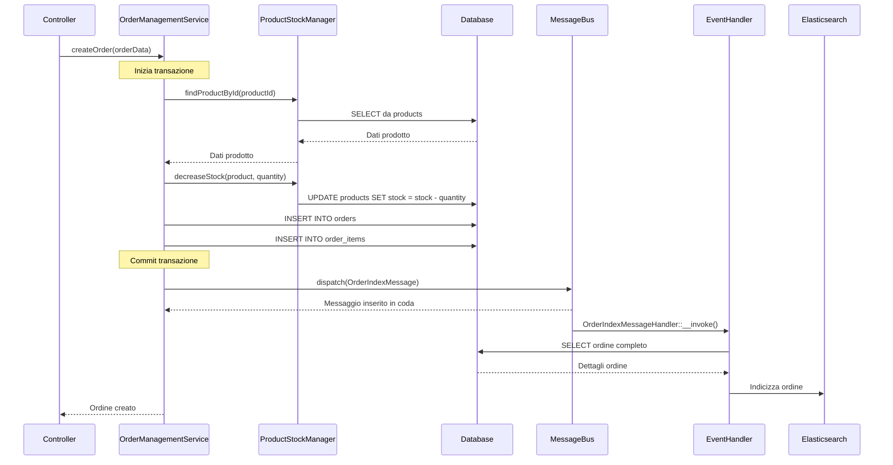
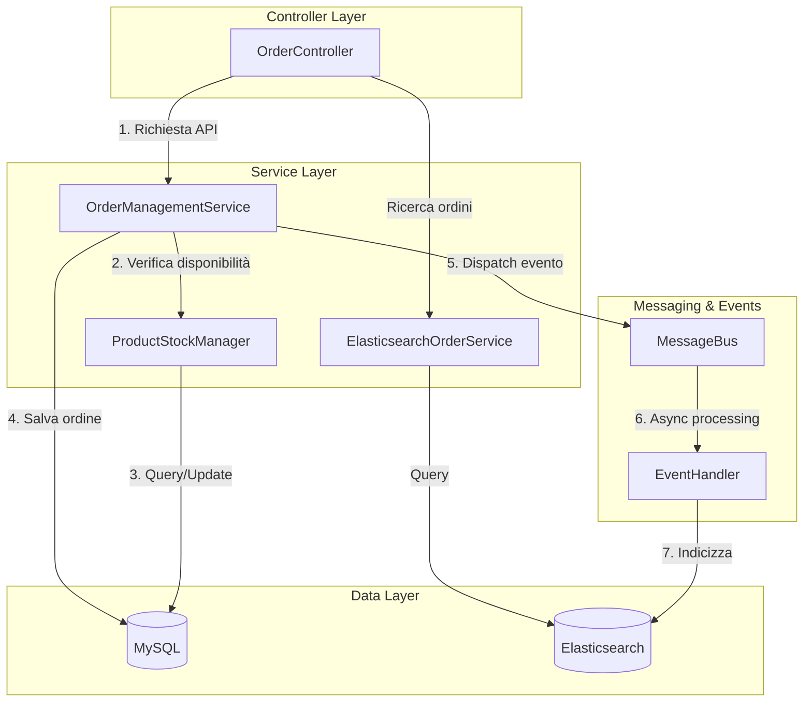
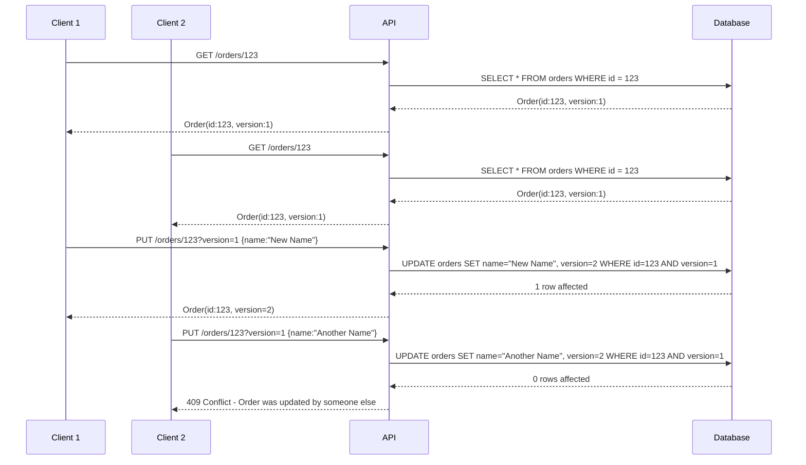
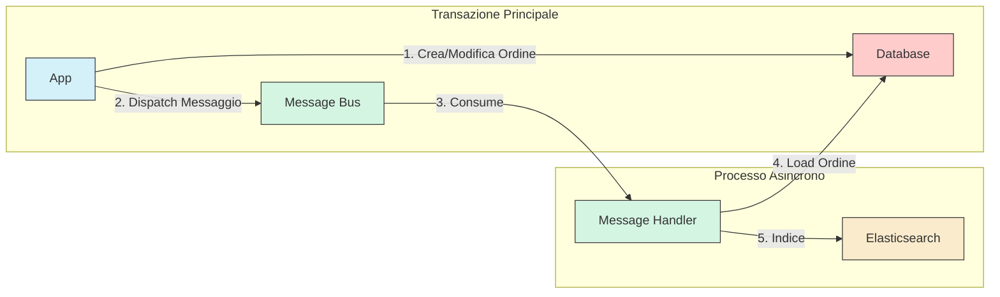
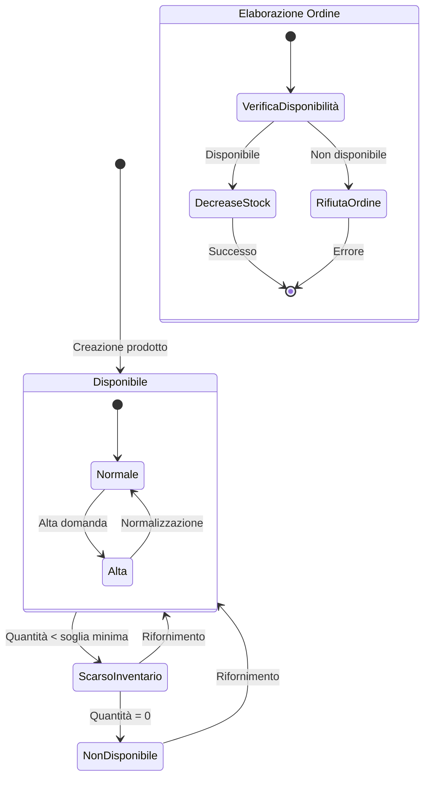

# Flussi di Servizio e Diagrammi

Di seguito sono riportati i principali flussi di interazione tra i servizi dell'applicazione, rappresentati attraverso diagrammi Mermaid.

## Flusso di Creazione degli Ordini

## Architettura del Sistema di Elaborazione Ordini

## Versioning Ottimistico

## Flusso di Indicizzazione Elasticsearch via Messenger

## Gestione dello Stock dei Prodotti

