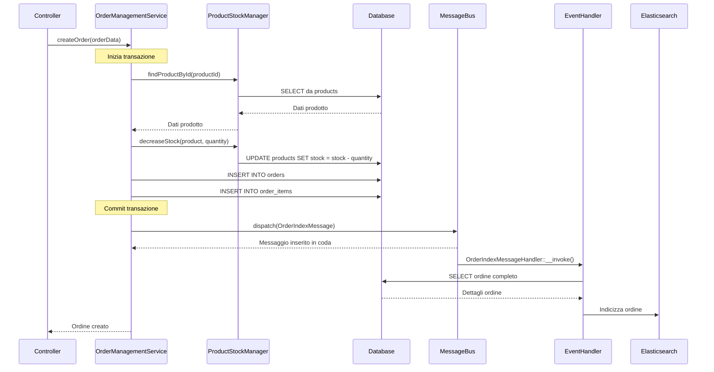
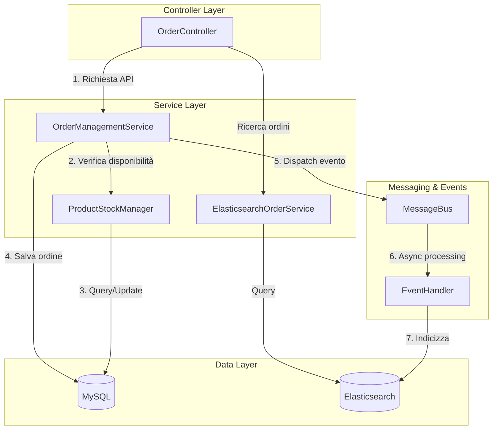
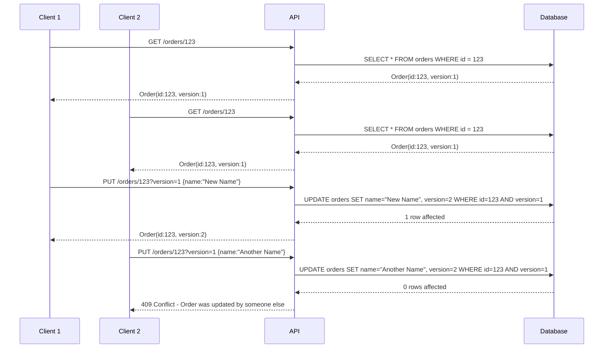
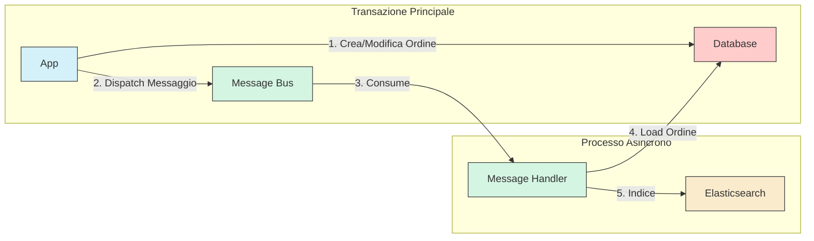
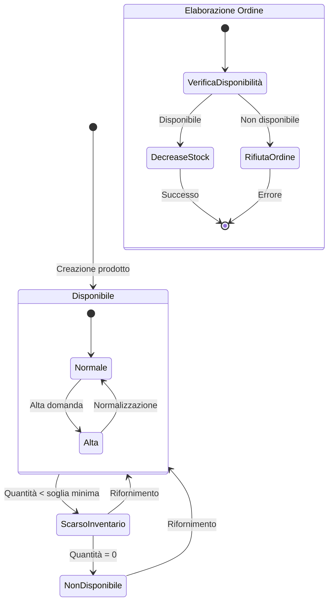

# Order-Product API

Un'applicazione di esempio che gestisce ordini e prodotti con un sistema di versioning ottimistico, integrazione Elasticsearch e validazione avanzata. Il progetto è strutturato come un **monolite con architettura MVC** (Model-View-Controller), offrendo un punto di partenza solido e ben organizzato per lo sviluppo di API REST.

## Descrizione del Progetto

Questa API RESTful dimostra una soluzione robusta per la gestione di un sistema di ordini e prodotti, implementando pattern moderni di sviluppo e best practice. Le funzionalità principali includono:

- **Sistema CRUD completo** per ordini e prodotti
- **Versioning ottimistico** per prevenire conflitti di concorrenza
- **Ricerca avanzata** utilizzando Elasticsearch
- **Validazione dei dati** robusta con feedback dettagliato
- **Health check** per monitorare lo stato dei servizi
- **Test automatizzati** per garantire l'affidabilità del codice

## Stack Tecnologico

- **Framework**: [Symfony 6.x](https://symfony.com/doc/6.4/index.html)
- **Database**: MySQL 8.0
- **Ricerca**: [Elasticsearch 7.17](https://www.elastic.co/guide/en/elasticsearch/reference/7.17/index.html) con [FOSElasticaBundle](https://github.com/FriendsOfSymfony/FOSElasticaBundle/blob/master/doc/index.md)
- **Messaging**: [Symfony Messenger](https://symfony.com/doc/6.4/messenger.html) per la comunicazione asincrona
- **Documentazione API**: [Nelmio API Doc](https://github.com/nelmio/NelmioApiDocBundle) con [Swagger PHP](https://zircote.github.io/swagger-php/)
- **Containerizzazione**: Docker e Docker Compose
- **Testing**: PHPUnit
- **Validazione**: Symfony Validator

## Documentazione librerie esterne

- [**symfony/messenger**](https://symfony.com/doc/6.4/messenger.html): Implementa un sistema di messaging che permette di inviare messaggi e gestirli tramite handler, supportando sia processi sincroni che asincroni.
- [**friendsofsymfony/elastica-bundle**](https://github.com/FriendsOfSymfony/FOSElasticaBundle/blob/master/doc/index.md): Integra Elastica in Symfony, fornendo funzionalità per l'indicizzazione di oggetti Doctrine in Elasticsearch e la ricerca complessa.
- [**zircote/swagger-php**](https://zircote.github.io/swagger-php/): Genera documentazione OpenAPI/Swagger direttamente dai commenti PHP, utilizzato insieme a NelmioApiDocBundle per creare la UI della documentazione API.

## Requisiti

- Docker e Docker Compose
- Git
- PHP 8.1+ (per esecuzione locale)
- Composer (per esecuzione locale)

## Installazione

### Utilizzo con Docker (raccomandato)

1. Clona il repository:
   ```bash
   git clone https://your-repository-url/order-product-poc.git
   cd order-product-poc
   ```

2. Avvia i container Docker:
   ```bash
   docker-compose up -d
   ```

3. Installa le dipendenze:
   ```bash
   docker-compose exec php-fpm composer install
   ```

4. Crea il database e carica i dati iniziali:
   ```bash
   docker-compose exec php-fpm php bin/console doctrine:migrations:migrate --no-interaction
   ```

5. Carica i dati di esempio (Opzionale):
   ```bash
   docker-compose exec php-fpm php bin/console doctrine:fixtures:load --no-interaction
   ```

6. Cancella l'indice Elasticsearch:
   ```bash
   docker-compose exec php-fpm php bin/console fos:elastica:delete 

   ```
7. Popola l'indice Elasticsearch:
   ```bash
   docker-compose exec php-fpm php bin/console fos:elastica:populate

   ```

8. Avvia il Symfony Messenger worker per l'elaborazione asincrona dei messaggi:
   ```bash
   docker-compose exec php-fpm php bin/console messenger:consume async -vv
   ```
   Questo comando avvia il worker che si occupa dell'elaborazione dei messaggi in coda, inclusa l'indicizzazione degli ordini in Elasticsearch quando vengono creati o modificati. Il flag `-vv` attiva la modalità verbose per visualizzare più dettagli sull'elaborazione dei messaggi.


9. Accesso in bash al container PHP per utilizzare la CLI di Symfony:
   ```bash
   docker-compose exec php-fpm bash
   ```

## Esecuzione

L'applicazione è accessibile ai seguenti URL:

- **Documentazione API**: http://localhost:8080/api/doc
- **API Rest**: http://localhost:8080/api
- **Adminer** (gestione database): http://localhost:8081
- **Kibana** (interfaccia Elasticsearch): http://localhost:5601

## Struttura del Progetto

Il progetto segue una struttura Symfony standard con alcune personalizzazioni per supportare le funzionalità specifiche:

```
├── bin/                            # Eseguibili di Symfony
│   ├── console                     # CLI di Symfony
│   └── phpunit                     # Eseguibile per i test
├── config/                         # Configurazione dell'applicazione
│   ├── bundles.php                 # Registrazione dei bundle
│   ├── packages/                   # Configurazioni specifiche per pacchetti
│   │   ├── doctrine.yaml           # Configurazione database
│   │   ├── fos_elastica.yaml       # Configurazione Elasticsearch
│   │   ├── messenger.yaml          # Configurazione message bus
│   │   └── nelmio_api_doc.yaml     # Configurazione documentazione API
│   └── services.yaml               # Definizione dei servizi e dipendenze
├── docker/                         # Configurazione Docker
│   ├── nginx/                      # Configurazione server web
│   └── php/                        # Dockerfile PHP
├── migrations/                     # Migrazioni del database Doctrine
├── public/                         # Entry point pubblico
│   └── index.php                   # Front controller
├── src/                            # Codice sorgente dell'applicazione
│   ├── Command/                    # Comandi CLI personalizzati
│   │   └── ElasticsearchPopulateCommand.php # Comando per popolare Elasticsearch
│   ├── Controller/                 # API controllers
│   │   ├── HealthCheckController.php  # Endpoint di health check
│   │   ├── OrderController.php     # CRUD e ricerca per ordini
│   │   └── Dto/                    # Data Transfer Objects
│   │       ├── CreateOrderRequest.php # DTO per la creazione ordini
│   │       └── UpdateOrderRequest.php # DTO per l'aggiornamento ordini
│   ├── DataFixtures/               # Dati di esempio
│   │   ├── Order/                  # Fixture per gli ordini
│   │   └── Product/                # Fixture per i prodotti
│   ├── Entity/                     # Modelli di dati (Doctrine)
│   │   ├── Order.php               # Entità ordine
│   │   ├── OrderItem.php           # Entità item dell'ordine
│   │   └── Product.php             # Entità prodotto
│   ├── Event/                      # Eventi di dominio
│   │   └── Order/                  # Eventi specifici per ordini
│   ├── Message/                    # Messaggi per Symfony Messenger
│   │   └── OrderIndexMessage.php   # Messaggio per indicizzare ordini
│   ├── MessageHandler/             # Handler per i messaggi
│   │   └── OrderIndexMessageHandler.php # Handler per l'indicizzazione
│   ├── Repository/                 # Repository per l'accesso ai dati
│   │   ├── OrderRepository.php     # Operazioni sul database per ordini
│   │   └── ProductRepository.php   # Operazioni sul database per prodotti
│   └── Service/                    # Servizi di business logic
│       ├── ElasticsearchOrderService.php # Servizio per la ricerca ordini
│       ├── Order/                  # Servizi per la gestione ordini
│       │   └── OrderManagementService.php # Logica CRUD per ordini
│       ├── Product/                # Servizi per la gestione prodotti
│       │   ├── ProductStockManager.php           # Gestione stock prodotti
│       │   └── ProductStockManagerInterface.php  # Interfaccia per inversione dipendenze
│       └── Request/                # Servizi per la gestione delle richieste
│           └── RequestProcessor.php # Validazione e processamento richieste
├── templates/                      # Template Twig (non utilizzati nelle API)
├── tests/                          # Test automatizzati
│   ├── ApiTestCase.php             # Classe base per i test API
│   ├── Functional/                 # Test funzionali
│   │   └── Controller/             # Test dei controller
│   │       ├── HealthCheckControllerTest.php # Test health check
│   │       └── OrderControllerTest.php       # Test CRUD ordini
│   └── Unit/                       # Test unitari
│       └── Service/                # Test dei servizi
├── docker-compose.yml              # Definizione dell'ambiente Docker
├── phpunit.dist.xml                # Configurazione PHPUnit
├── run-tests.sh                    # Script per esecuzione test
└── setup-test-db.sh                # Script per setup database di test
```

Questa struttura di progetto è organizzata seguendo i principi delle Clean Architecture, con una chiara separazione tra:

- **Presentation Layer**: Controller, DTO e API endpoints
- **Application Layer**: Servizi che orchestrano le operazioni
- **Domain Layer**: Entità, eventi di dominio e logica di business
- **Infrastructure Layer**: Repository, implementazioni concrete dei servizi e integrazioni

## API Endpoints

### Ordini

- `GET /api/orders` - Ricerca ordini con filtri e paginazione
- `GET /api/orders/{id}` - Ottieni dettagli di un ordine specifico
- `POST /api/orders` - Crea un nuovo ordine
- `PUT /api/orders/{id}` - Aggiorna un ordine (richiede version)
- `DELETE /api/orders/{id}` - Elimina un ordine (richiede version)

### Health Check

- `GET /health` - Verifica lo stato dell'applicazione e dei servizi

## Sistema di Versioning Ottimistico

Il progetto implementa un sistema di versioning ottimistico per prevenire conflitti di aggiornamento degli ordini. Ogni operazione di modifica o cancellazione richiede il parametro `version` che deve corrispondere alla versione corrente dell'ordine nel database. Se la versione non corrisponde, l'API restituisce un errore 409 Conflict.

Esempio:
```json
PUT /api/orders/123?version=2
{
    "name": "Ordine aggiornato"
}
```

## Testing

Il progetto include una suite completa di test automatizzati:

- **Test unitari**: Testano i componenti individuali
- **Test funzionali**: Testano i controller e l'integrazione tra componenti
- **Test API**: Verificano il comportamento degli endpoint

### Esecuzione di tutti i test

Il modo più semplice per eseguire tutti i test è utilizzare lo script `run-tests.sh`:

```bash
./run-tests.sh
```

Questo script prepara l'ambiente di test, configura il database di test e esegue tutti i test nel container PHP. Inoltre, genera automaticamente un report di copertura del codice in formato HTML nella cartella `coverage-html`, che può essere consultato aprendo il file `coverage-html/index.html` in un browser per visualizzare in modo dettagliato quali parti del codice sono coperte dai test.

### Esecuzione di test specifici

In alternativa, puoi accedere direttamente al container PHP per eseguire test specifici:

```bash
# Accedi al container PHP
docker docker-compose exec php-fpm bash

# Esegui tutti i test nell'ambiente test
php bin/phpunit --env=test

# Esegui solo i test di un controller specifico
php bin/phpunit --env=test tests/Functional/Controller/OrderControllerTest.php

# Esegui un singolo test
php bin/phpunit --env=test --filter testCreateOrder tests/Functional/Controller/OrderControllerTest.php
```

Prima di eseguire i test in questo modo, puoi preparare manualmente il database di test eseguendo:

```bash
php bin/console doctrine:database:drop --if-exists --force --env=test
php bin/console doctrine:database:create --env=test
php bin/console doctrine:schema:create --env=test
php bin/console doctrine:fixtures:load --no-interaction --env=test
```

## Considerazioni Implementative

### Validazione dei Dati

La validazione dei dati utilizza i constraint di Symfony e un sistema personalizzato di DTO (Data Transfer Objects) per garantire l'integrità dei dati. I messaggi di errore sono localizzati e forniscono un feedback dettagliato all'utente.

### Ricerca con Elasticsearch

L'implementazione della ricerca utilizza Elasticsearch per permettere query complesse su ordini, inclusi filtri per data e ricerca testuale. Le operazioni CRUD su ordini vengono automaticamente sincronizzate con l'indice Elasticsearch tramite eventi di dominio processati in modo asincrono.

### Concurrency Control

Il sistema implementa un controllo di concorrenza ottimistico basato su numeri di versione. Questo assicura che quando più utenti modificano lo stesso ordine contemporaneamente, le modifiche non vengano sovrascritte involontariamente.

### Gestione dello Stock dei Prodotti

Quando viene creato un ordine, il sistema verifica e aggiorna automaticamente la disponibilità del prodotto. Se un prodotto non è disponibile in quantità sufficiente, l'ordine viene rifiutato con un messaggio di errore appropriato.

### Architettura Estensibile e Inversione delle Dipendenze

Il progetto utilizza il pattern dell'inversione delle dipendenze per garantire flessibilità e scalabilità. Un esempio chiave è il sistema di gestione dei prodotti:

- L'interfaccia `ProductStockManagerInterface` definisce un contratto per la gestione degli stock dei prodotti
- L'implementazione corrente `ProductStockManager` utilizza il database locale per gestire i prodotti
- Grazie all'iniezione delle dipendenze configurata in `services.yaml`, è possibile sostituire facilmente l'implementazione

```yaml
# config/services.yaml
App\Service\Product\ProductStockManagerInterface: '@App\Service\Product\ProductStockManager'
```

Per rendere il sistema ancora più robusto e orientato alla persistenza dei dati storici, l'architettura implementa un pattern di "snapshot dei prodotti". Quando un prodotto viene aggiunto a un ordine, l'entità `OrderItem` salva non solo il riferimento al prodotto ma anche una copia completa dei dati rilevanti del prodotto (nome, prezzo, ecc.). Questo approccio garantisce che:

- Gli ordini mantengano uno storico dei dati dei prodotti anche se questi vengono in seguito modificati o eliminati
- Sia possibile generare report e statistiche accurate basate sui dati al momento dell'ordine
- Il sistema rimanga resiliente ai cambiamenti esterni nella gestione dei prodotti

Questo design orientato alla storicizzazione, combinato con l'inversione delle dipendenze, permette di:
- Creare implementazioni alternative che si interfacciano con API esterne
- Sostituire il sistema di gestione prodotti senza modificare il codice che lo utilizza
- Supportare facilmente microservizi distribuiti dove i prodotti sono gestiti da un altro sistema
- Implementare strategie di cache o proxy per ottimizzare le prestazioni
- Mantenere l'integrità dei dati storici per esigenze di business intelligence e reportistica

Per esempio, si potrebbe creare un `ExternalApiProductStockManager` che si connette a un servizio REST esterno, e basterà aggiornare la configurazione nei services.yaml senza modificare il resto dell'applicazione. Indipendentemente dalla fonte dei dati dei prodotti, gli ordini manterranno sempre uno snapshot completo dei prodotti al momento dell'acquisto.

## Considerazioni personali e analisi sulla roadmap di una revisione architetturale (possibilità di evoluzione verso DDD e CQRS)
Attualmente, il progetto è strutturato come un monolite con architettura MVC. Questa scelta offre diversi vantaggi, tra cui:

- **Semplicità di sviluppo e distribuzione**: Tutto il codice è in un unico posto e può essere facilmente gestito e distribuito.
- **Performance**: Le chiamate interne tra componenti sono più veloci rispetto a un'architettura a microservizi.
- **Coerenza**: Un'unica base di codice significa che tutte le parti dell'applicazione sono sempre in uno stato coerente.

Tuttavia, un'architettura monolitica può presentare delle sfide, come la difficoltà di scalare singole parti dell'applicazione in modo indipendente e la potenziale complessità nel gestire un codice sorgente di grandi dimensioni.

### Evoluzione e road map verso DDD e CQRS

L'approccio ideale per un'evoluzione architetturale del sistema sarebbe l'adozione dei pattern **Domain-Driven Design (DDD)** e **Command Query Responsibility Segregation (CQRS)**. Questi pattern sarebbero particolarmente adatti al contesto attuale per diverse ragioni:

#### Fondamenta già presenti

È importante notare che alcune fondamenta per questa evoluzione architetturale sono già state strategicamente implementate:

- **Symfony Messenger**: La scelta di utilizzare questo componente non è casuale, ma rappresenta un primo passo verso un'architettura orientata agli eventi. Il bus comunicativo asincrono già presente nell'applicazione potrà facilmente accogliere servizi esterni e gestire la comunicazione tra componenti disaccoppiati in un futuro sistema distribuito.
- **Elasticsearch come read model**: L'attuale implementazione della ricerca ordini utilizza già Elasticsearch come database ottimizzato per le query, fornendo una naturale separazione tra operazioni di lettura e scrittura.
- **Pattern di Event Dispatching**: Il sistema già utilizza eventi di dominio per notificare cambiamenti agli ordini, facilitando l'implementazione di Event Sourcing in futuro.

### Implementazione pratica

Una possibile roadmap per questa evoluzione architetturale potrebbe essere:

1. **Riorganizzazione del codice esistente**:
   - Separare il dominio in bounded contexts (es. Order, Product)
   - Introdurre pattern come Value Objects, Aggregates e Entities
   - Implementare una struttura a layer (Domain, Application, Infrastructure, Presentation)

2. **Implementare CQRS**:
   - Separare Command e Query Models
   - Utilizzare Elasticsearch come modello di query dedicato (già parzialmente implementato)
   - Introdurre un Command Bus per la gestione delle operazioni di scrittura
   - Implementare Event Handlers per sincronizzare i modelli di lettura e scrittura

3. **Migrazione verso microservizi**:
   - Una volta identificati i bounded contexts, è possibile estrarli come servizi indipendenti
   - Introdurre comunicazione asincrona tra servizi tramite eventi di dominio
   - Implementare API Gateway per l'orchestrazione delle richieste
   - Adottare pattern come Saga per gestire transazioni distribuite

Questo approccio permetterebbe una transizione graduale dal monolite attuale verso un'architettura più scalabile e manutenibile, sfruttando al meglio le caratteristiche già presenti come l'uso di Elasticsearch e la gestione asincrona degli eventi.

## Diagrammi di Architettura e Flussi di Servizio

Di seguito sono riportati alcuni diagrammi che illustrano i principali flussi e interazioni tra i servizi dell'applicazione.

### Flusso di Creazione degli Ordini



### Architettura del Sistema di Elaborazione Ordini



### Versioning Ottimistico



### Flusso di Indicizzazione Elasticsearch via Messenger



### Gestione dello Stock dei Prodotti



Questi diagrammi forniscono una visualizzazione chiara dei principali flussi di lavoro e interazioni del sistema. La notazione Mermaid è supportata direttamente su GitHub e molte altre piattaforme di documentazione, rendendo questi diagrammi immediatamente visualizzabili.
